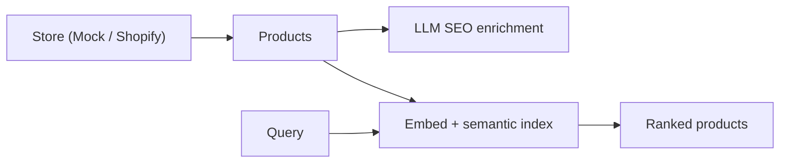

# 🛍️ AI E-commerce Integration


Connect an e-commerce store, then add an **AI layer**: auto-generate **SEO**
copy for every product and run **semantic search** over the catalog. Built on a
clean **connector interface** — works offline with a mock store, or against the
real **Shopify** Admin API.

> Part of a multi-domain AI portfolio. Same engineering bar as my finance
> projects: clean `src/` package, pluggable interfaces, and tests that run with
> **no API key**.

## ✨ Features

- **Pluggable store connectors** — `MockStore` (offline) and `ShopifyConnector`
  (real Admin API) behind one `StoreConnector` interface.
- **AI SEO enrichment** — LLM-generated SEO title, meta description, persuasive
  copy, and keyword tags (provider-swappable Claude/OpenAI); pushable back to
  the store.
- **Semantic search** — find products by intent using local embeddings and
  pure-Python cosine (no vector DB, no key).
- **Tested core** — ranking, models, and connectors unit-tested with a fake
  embedder.

## 🏗️ Architecture



Details in [`docs/architecture.md`](docs/architecture.md).

## 🚀 Quickstart

```bash
pip install -e .
pip install -r requirements.txt

# 1. Pull the (mock) catalog + build the semantic index — no key needed
python scripts/sync.py

# 2. Search by natural language
python scripts/search.py "comfortable shoes for jogging"
python scripts/search.py "something to keep drinks cold outdoors"

# 3. AI SEO enrichment (needs an API key) — shows before/after
cp .env.example .env      # add ANTHROPIC_API_KEY
python scripts/enrich.py --limit 2
```

Example search output:

```
Top 3 for: "comfortable shoes for jogging"
  0.62  Trail Running Shoes   ($119.9)  [Footwear]
  0.41  Running Socks (3 pack)  ($18.0)  [Footwear]
  0.22  Yoga Mat Pro          ($39.9)  [Fitness]
```

## 🔌 Use a real store (Shopify)

```python
from shopai.connectors.shopify import ShopifyConnector
products = ShopifyConnector().fetch_products()   # set SHOPIFY_STORE + SHOPIFY_TOKEN
```

The rest of the pipeline (enrich, index, search) is identical — that's the point
of the connector interface.

## 🗂️ Project structure

```
ai-ecommerce-integration/
├── src/shopai/
│   ├── models.py          # Product / Seo
│   ├── connectors/        # base + mock + shopify
│   ├── embed.py           # local embeddings
│   ├── search.py          # SemanticIndex (pure-Python cosine)
│   ├── enrich.py          # LLM SEO enrichment
│   └── pipeline.py        # pull -> enrich -> index -> search
├── scripts/               # sync.py, search.py, enrich.py
├── data/sample_products.json
└── tests/                 # models, connector, search (no key)
```

## ✅ Tests

```bash
pytest -q     # models, mock connector, semantic ranking — all offline
```

## 🧭 Roadmap

- [x] Connector interface + Mock & Shopify implementations
- [x] Semantic search (local embeddings, tested ranking)
- [x] LLM SEO enrichment with before/after
- [ ] Product recommendations ("customers also viewed")
- [ ] Review summarization + sentiment
- [ ] Small web UI + deployment

## 📄 License

MIT — see [LICENSE](LICENSE).

---

Built by **Arturio Amorim Sobrinho** — AI/LLM Engineer.
[GitHub](https://github.com/arturio-amorim) · [LinkedIn](https://www.linkedin.com/in/arturio-amorim-33b60736/)
