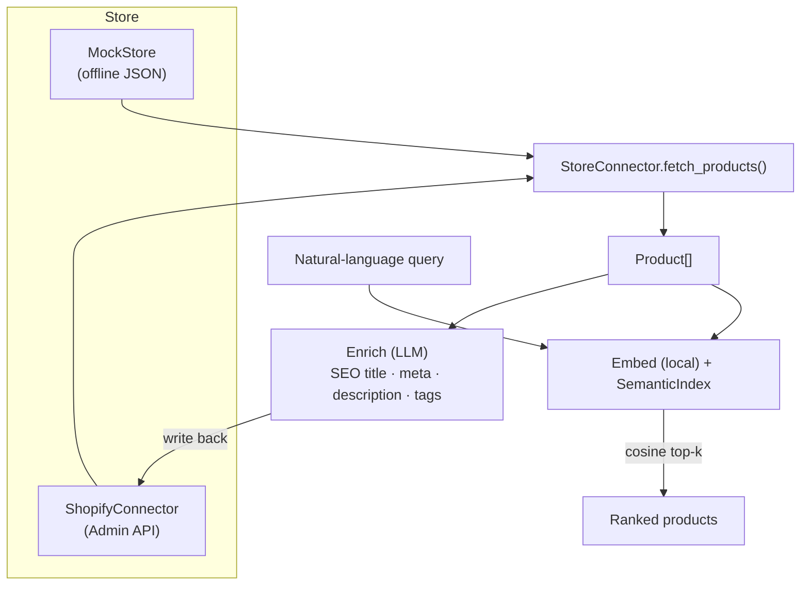

# Architecture

## Design choices

- **One connector interface.** `StoreConnector` abstracts the store, so the
  same pipeline runs against the offline `MockStore` or the real
  `ShopifyConnector` — and adding WooCommerce/VTEX is just another subclass.
- **Local embeddings + pure-Python cosine.** Semantic search needs no API key
  and no heavy vector DB at this scale; the ranking logic is unit-tested with a
  fake embedder (zero ML deps in tests).
- **LLM only where it adds value.** The single paid step is SEO enrichment
  (titles, meta descriptions, copy, tags) — provider-swappable Claude/OpenAI.
- **Write-back path.** Enriched fields can be pushed back to the store
  (`update_product`), closing the integration loop.

## Where AI helps in e-commerce

- **Catalog enrichment** — turn sparse product data into SEO-ready copy at scale.
- **Semantic search** — shoppers find products by intent ("warm waterproof
  jacket"), not just exact keywords.
- **(Roadmap)** recommendations, review summarization, support agents.
